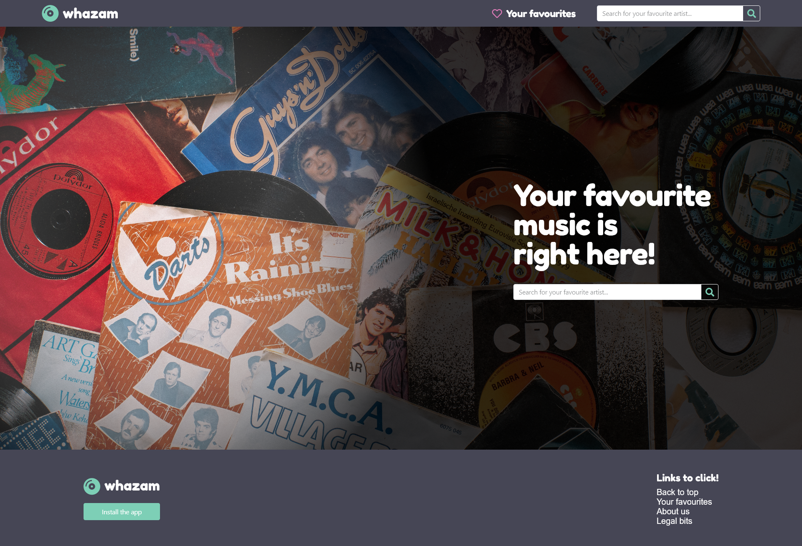
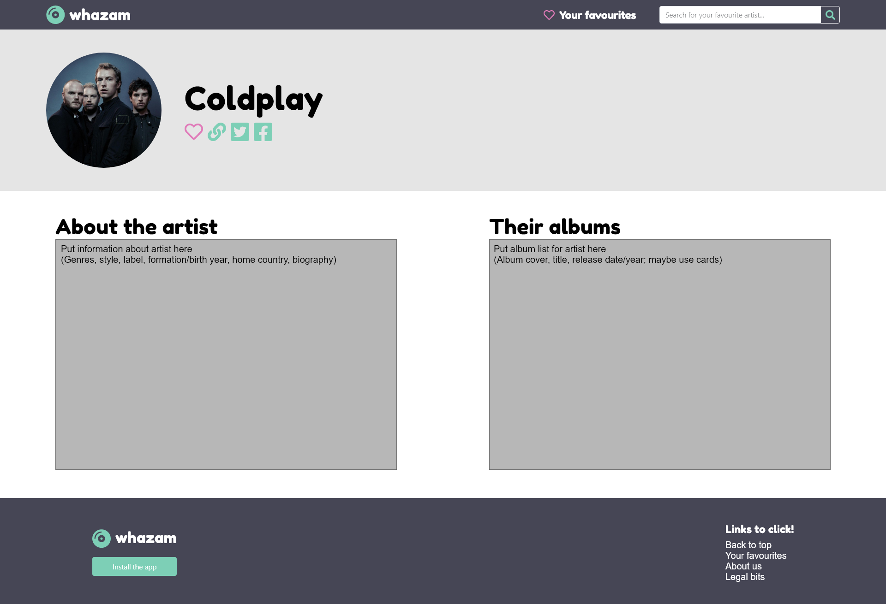

# Application idea summary

## What is *whazam*

*"Anyone have a creative idea for the name of our app?"* 
*"whazam. Like Shazam but whacky"*

whazam is a web application that allows users to search their favourite artists and their music. Built with the _"TheAudioDB"_ API, the application has access to data of over 204,000 albums and almost 2,700,000 tracks. We extend this data by further employing the _lyrics.ovh_ API by NTag. Combining those two APIs, we can create an informative and useful tool for music enthusiasts.

## Outline of development process

### Planning

In the inital meeting and continued conversation, we developed the idea of *whazam*. Looking at big lyrics search engines such as Genius or Shazam, we understood the requirements for such an app and common design or layout principles. We further researched viable database options and settled vor *TADB* and *lyrics.ovh*. Additionally, we chose our CSS library (Bootstrap) and JavaScript framework (Vue.js).

### Design

The following are example wireframes from our website mockups. Find all wireframes, additional design resources and a link to the interactive mockup here.

### Development

After the design was discussed during the meeting, we allocated first tasks. Our approach was to begin with the layout and presentation development (i.e. HTML and CSS), and add the necessary logic later on. A blank template and style sheets were used to ensure a consistent design of navbar and footer throughout the page.

For communcation, a private Teams channel was used. Task management was done with the help of the Issues and Projects functionality on GitHub. We automated the progress, so that new issues will automatically be dropped into the project's Kanban board and resolved when pulled into the "Completed" column. 